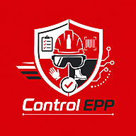
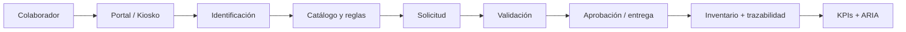
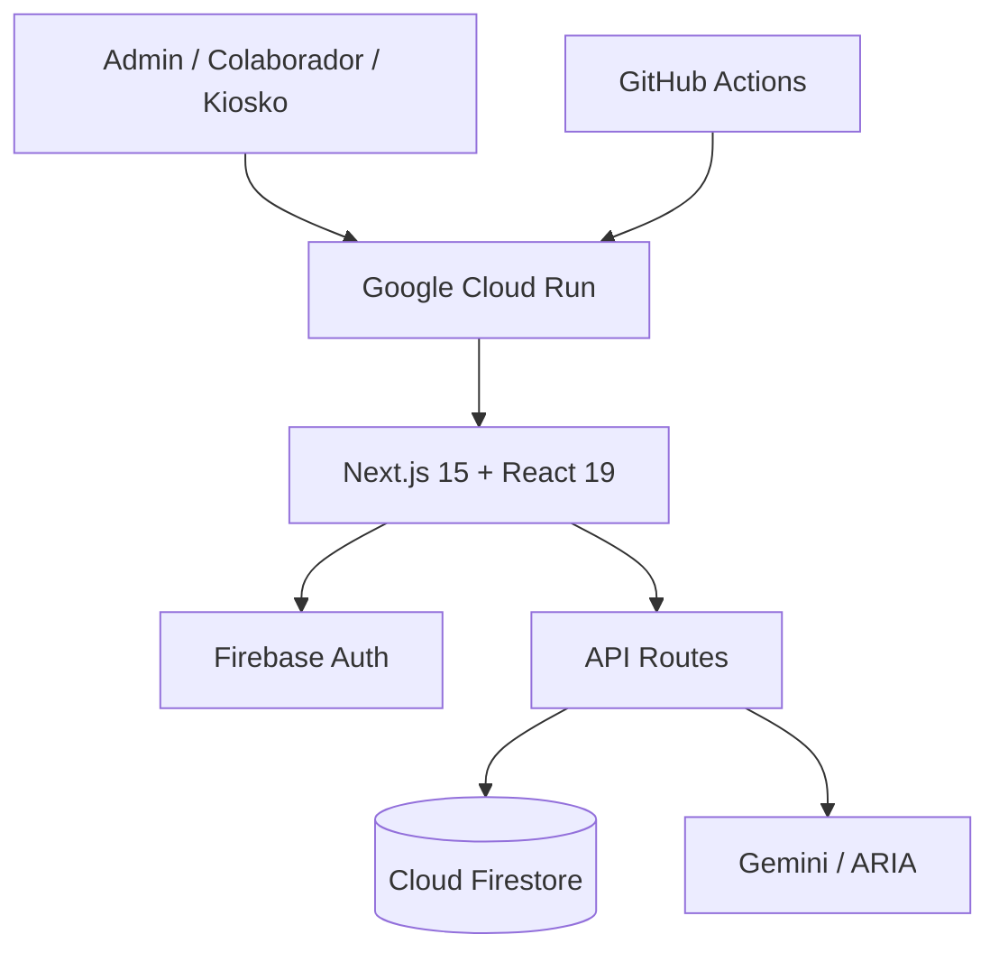

<div align="center">
  

  # 🛡️ AssetGuard

  **Plataforma de gestión y trazabilidad de Equipo de Protección Personal para operaciones industriales.**

  Inventario · Colaboradores · Kiosko · Dotaciones · Auditoría · Analítica con IA

  [](https://nextjs.org/)
  [](https://react.dev/)
  [](https://www.typescriptlang.org/)
  [](https://firebase.google.com/)
  [](https://cloud.google.com/run)
  [](https://github.com/Joseluiscruz-hub/control-de-epp/actions/workflows/ci.yml)

  **[Abrir producción](https://control-de-epp-659644890317.us-central1.run.app)**
</div>

---

## ¿Qué es AssetGuard?

**AssetGuard** digitaliza la operación de Equipo de Protección Personal (EPP) en planta. Centraliza colaboradores, inventario, solicitudes, dotaciones, reposiciones y trazabilidad, e incorpora **ARIA**, un asistente de análisis operacional basado en Gemini.

> El objetivo no es solo registrar entregas: es convertir la operación de EPP en un sistema confiable, auditable y preparado para datos reales de planta.

## Capacidades

| Módulo | Propósito |
| --- | --- |
| **Dashboard** | KPIs, señales de inventario, solicitudes y actividad reciente. |
| **Personal** | Directorio, altas e importación masiva de colaboradores. |
| **Inventario** | Catálogo EPP, SKU, tallas, variantes, stock y ajustes. |
| **Portal** | Consulta de EPP asignado por colaborador. |
| **Kiosko** | Identificación y solicitud de equipo. |
| **Trazabilidad** | Historial de dotaciones, reposiciones y movimientos. |
| **ARIA** | Analítica operacional asistida por Gemini. |

## Flujo operativo



## Estado actual

- ✅ Autenticación Google y control por perfil/planta.
- ✅ Importación masiva de personal e inventario.
- ✅ Inventario por SKU, talla, variante y stock.
- ✅ Portal del colaborador y kiosko de solicitudes.
- ✅ Dotaciones y reposiciones con trazabilidad.
- ✅ Validaciones server-side y transacciones para operaciones críticas.
- ✅ Firebase App Check y Firestore Security Rules.
- ✅ ARIA con Gemini desde servidor.
- ✅ Tests, typecheck, lint y build automatizados.
- ✅ Staging automático y promoción controlada a producción en Cloud Run.

## Arquitectura



La arquitectura separa la experiencia administrativa de los flujos públicos y procesa en servidor las operaciones que requieren validaciones críticas.

## Seguridad por diseño

- Autenticación y autorización administrativa.
- Alcance por perfil y planta.
- Operaciones sensibles procesadas en servidor.
- Reglas de seguridad y validación de datos en Firestore.
- App Check como capa adicional de protección.
- Integraciones externas ejecutadas desde servidor.
- Transacciones para preservar consistencia de inventario.
- Minimización de datos en flujos públicos.

## Stack

| Capa | Tecnología |
| --- | --- |
| Frontend | Next.js 15 · React 19 · TypeScript 5 |
| Datos | Cloud Firestore |
| Identidad | Firebase Authentication |
| Protección | Firebase App Check |
| IA | Google Gemini |
| Infraestructura | Google Cloud Run · Docker |
| CI/CD | GitHub Actions |
| Runtime | Node.js 20 |

## CI/CD

Cada pull request y push a `main` ejecuta:

```text
Lint → Typecheck → Tests → Firestore Rules → Build
```

El despliegue sigue un flujo controlado:

```text
main → Staging → Smoke tests → Promoción manual → Aprobación → Producción
```

Más detalles en [`docs/deployment.md`](docs/deployment.md).

## Desarrollo local

```bash
git clone https://github.com/Joseluiscruz-hub/control-de-epp.git
cd control-de-epp
npm install
cp .env.example .env.local
npm run local
```

Validación recomendada antes de un PR:

```bash
npm test
npm run test:firestore-rules
npm run typecheck
npm run lint
npm run build
```

## Documentación

- [`USO_LOCAL.md`](USO_LOCAL.md) — ejecución local.
- [`docs/deployment.md`](docs/deployment.md) — despliegue y promoción.
- [`docs/kiosk-session-flow.md`](docs/kiosk-session-flow.md) — flujo de sesión del kiosko.
- [`docs/staging-demo.md`](docs/staging-demo.md) — entorno de staging.

## Roadmap

- Matriz de autorización de EPP por área, puesto y función.
- Flujo de aprobación para EPP crítico.
- Trazabilidad ampliada de movimientos de inventario.
- Reportes ejecutivos por área, consumo y riesgo.
- Exportación de históricos para auditoría.
- Alertas operativas por correo o Teams.
- Fortalecimiento del modo offline para kioskos físicos.

## Autor

**José Luis Cruz Prieto** · [@Joseluiscruz-hub](https://github.com/Joseluiscruz-hub)

## Licencia

Este repositorio no incluye una licencia de código abierto. **Todos los derechos reservados.**
